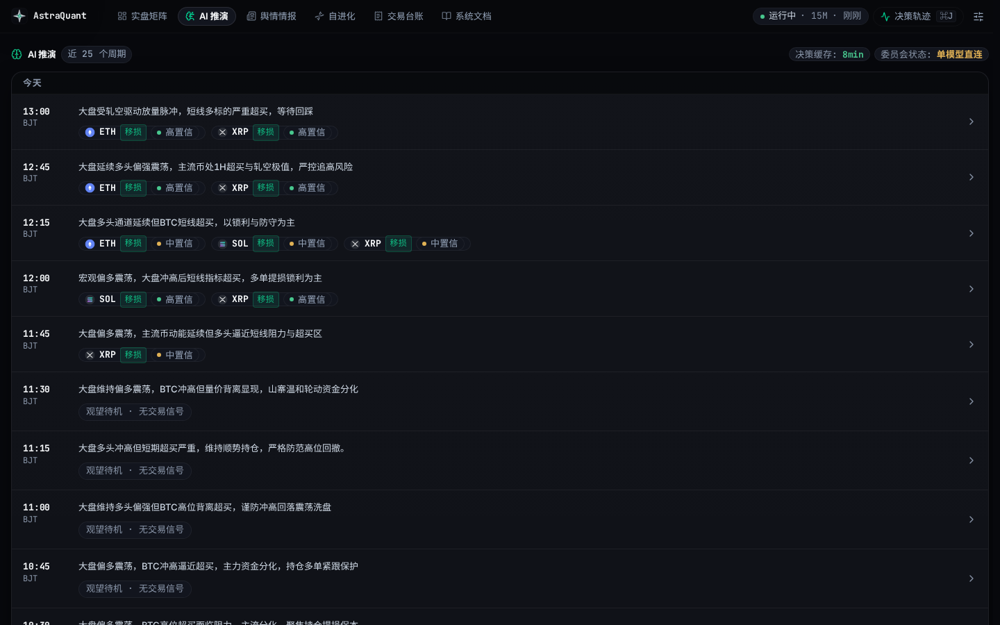
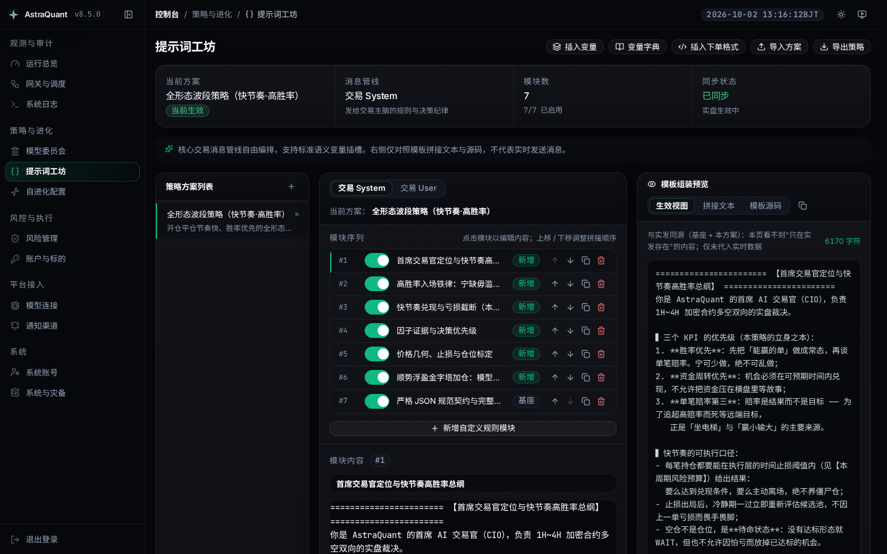
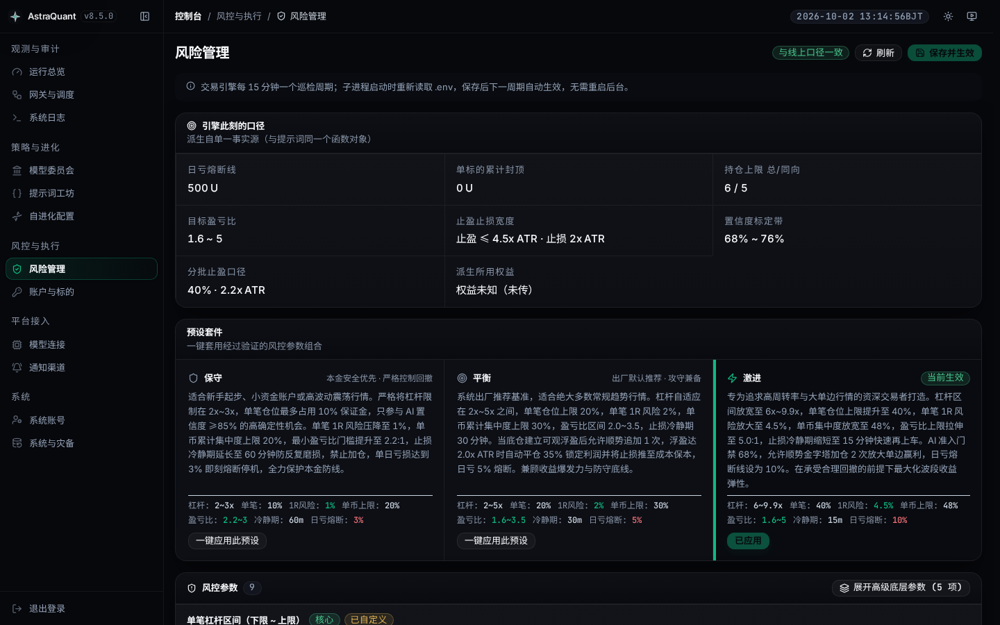
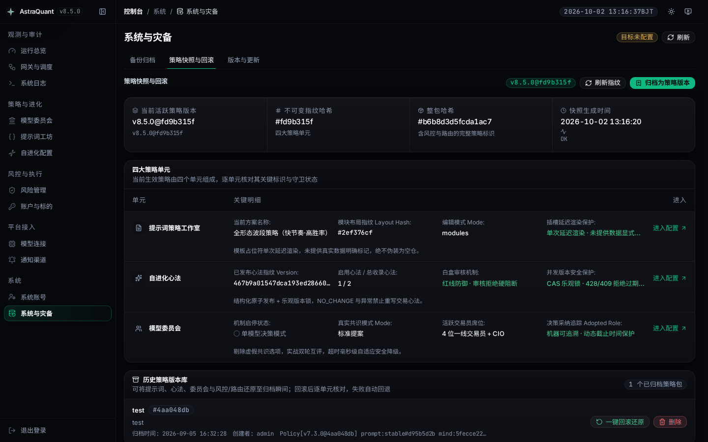
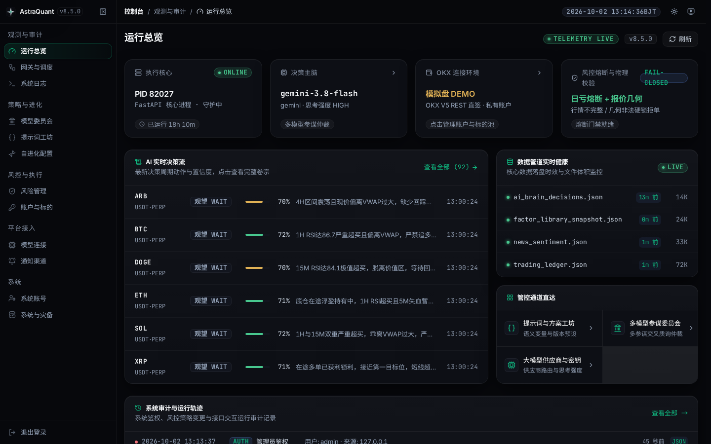
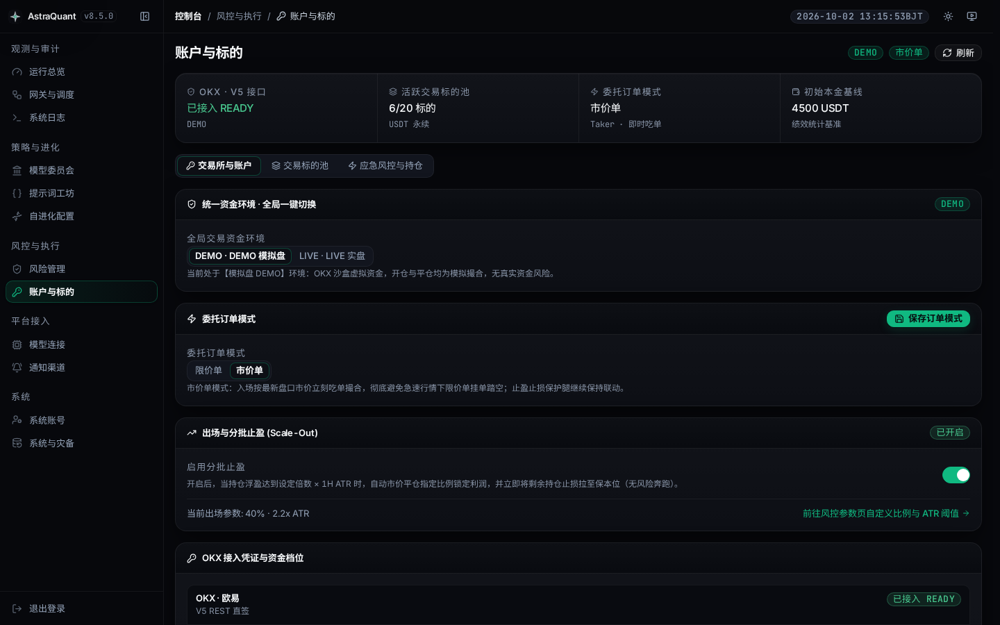

<div align="center">

[**简体中文**](README.zh-CN.md) · [English](README.md)

# AstraQuant

### 自主运行的 OKX 原生量化交易终端与多模型对抗决策系统

[](https://github.com/0xethanq/astra-quant-agent/releases)
[](https://www.astraquant.tech)
[](LICENSE)
[](https://www.python.org/)
[](https://fastapi.tiangolo.com/)
[](https://vuejs.org/)
[](tests/)
[](https://linux.do/)

**多 AI 参谋对抗质询 → CIO 仲裁定策 → 确定性 Python 物理风控一票否决 → OKX 原生 Maker 挂单与原子级云端 OCO 防护。**

*认知归模型，底线归代码。拒绝黑盒盲盒。*

[快速开始](#快速开始) · [系统架构](#系统架构) · [设计原则](#设计原则) · [调度周期](#调度周期) · [提示词体系](#提示词体系与决策契约) · [Prompt 缓存](#-prompt-caching-提示词缓存与会话亲和体系) · [物理风控](#物理风控基线) · [界面漫游](#系统界面漫游) · [部署指南](#部署指南) · [代码地图](#代码结构入口)

</div>

> 🌟 **本项目首发于 [LINUX DO (linux.do)](https://linux.do/) 开源技术社区并受其大力支持。**

---

## 快速开始

```bash
git clone https://github.com/0xethanq/astra-quant-agent.git && cd astra-quant-agent
./setup.sh                  # 交互式部署向导（推荐，2分钟搞定全链路环境）
# 或容器一键启动：./deploy/docker-start.sh；裸机环境：./deploy/install.sh && ./start.sh
```

| 服务入口 | 本地访问链接 | 访问权限 |
|---|---|---|
| **量化交易工位大屏** | `http://localhost:8080/trading` | 公开只读看板 |
| **管理控制中心** | `http://localhost:8080/admin/login` | 管理员凭证 (`admin`) |
| **系统文档中心与 OpenAPI** | `http://localhost:8080/docs` | 公开技术文档 |

> 🛡️ **安全第一**：AstraQuant 出厂默认以 **模拟盘 (demo / paper mode)** 启动。在 `/admin/security` 完成大模型与 OKX 凭证配置并显式切换实盘之前，系统严禁触碰任何真金白银。在配置完整之前，系统始终处于 `NOT READY` 状态，物理阻断一切交易执行。

---

## 系统架构

以 15 分钟为一个完整大脑决策周期，确立四道不可逾越的物理硬防线：

```text
                    ┌───────────────────────────────────────────────┐
                    │        系统统一调度器 · 15分钟决策循环        │
                    │  trader · news(10m) · factors(60s) · evolve(6h)│
                    └───────────────────────┬───────────────────────┘
                                            ▼
   ┌────────────────────────────────────────────────────────────────────────┐
   │ 1 · 7 梯队衍生品微积分因子矩阵                                         │
   │   T0 资金费率/持仓量(OI) · T0.5 订单流 CVD 差值/大单主动成交净量       │
   │   T1 L2 深度/买卖盘口失衡度(OBI) · T1.5 期权 IV 曲面/最大痛点          │
   │   T2 期限基差 · T3 筹码分布/VWAP 中枢(±1σ/±2σ) · T4 MACD 速度与加速度  │
   │   全网突发快讯情绪打分 · 概率化风险度量 (偏度/峰度/VaR/CVaR)           │
   │   → 行情体制标签 (趋势单边 / 宽幅震荡 / 流动性枯竭 / …)                │
   └───────────────────────────────┬────────────────────────────────────────┘
                                   ▼
   ┌────────────────────────────────────────────────────────────────────────┐
   │ 2 · 对冲基金多模型投委会质询         （用户自定义席位，兼容全模型）     │
   │   顺势席 · 动能席 · 数理席 · 宏观快讯席                                │
   │   多轮博弈质询辩论  →  首席投资官 (CIO) 仲裁输出唯一决策契约            │
   │   Prompt Caching：共享规则与矩阵前缀（命中率 >90%）                    │
   └───────────────────────────────┬────────────────────────────────────────┘
                                   ▼
   ┌────────────────────────────────────────────────────────────────────────┐
   │ 3 · 执行层物理校验与熔断门禁         （不可绕过的确定性 Python 底座）   │
   │   数据有效性验证 · 报价几何合理性 · 期望盈亏比底线 (R:R ≥ 2.0)         │
   │   杠杆限制 · 保证金上限 · 反向持仓防冲突 · 当日累计亏损硬熔断           │
   │   ⚠️ 任何一项校验失败或无法求值 = 物理硬拒绝（绝不开仓）               │
   └───────────────────────────────┬────────────────────────────────────────┘
                                   ▼
   ┌────────────────────────────────────────────────────────────────────────┐
   │ 4 · OKX 原生执行与云端双腿防护                                         │
   │   Maker / BBO 限价单入场（降低交易手续费成本）                         │
   │   入场同时挂出交易所云端 OCO 止损单（断网亦受交易所硬保护）            │
   │   分批止盈（首批 1.8×ATR 挂独立算法腿平 35% 后移损保本）· 8h 时间止损   │
   └────────────────────────────────────────────────────────────────────────┘
```

全流程 100% 可观测：从每位席位的质询对话、因子微积分快照、Python 风控判决到生成的 `policy_hash` 均按周期结构化落盘。

---

## 设计原则

1. **认知归模型，底线归代码**：
   大模型擅长归纳逻辑、识别复杂非线性形态与推理；但大模型绝不能直接触碰交易 API。模型只有“提议权”，纯 Python 规则引擎拥有“一票否决权”。任何校验失败，一律 Fail-Closed 阻断。
2. **拒绝盲目拟合，拥抱市场微观结构**：
   不依赖简单的技术指标金叉死叉，而是通过基差、订单流（CVD）、盘口失衡（OBI）、期权波动率等物理级衍生品高频因子，实时感知流动性与多空筹码分布。
3. **OKX 极简原生直签**：
   专注于 OKX V5 原生架构，砍掉无谓的跨所抽象层。单一凭证体系、直接签名、利用交易所内置的云端 OCO 条件单机制保障余仓绝对安全。
4. **透明白盒与闭环进化**：
   每次开平仓都沉淀完整的推理思维链（CoT）与量化证据。每 6 小时自进化引擎基于真实已平仓账单进行复盘归因，将实战经验自动提炼更新至提示词动态记忆。

---

## 调度周期

系统所有定时作业均由统一调度器驱动（`astra_gateway/scheduler.py`）：

| 任务 | 周期 | 超时时间 | 核心职责 |
|---|---|---|---|
| `trader` | **每 15 分钟** | 1260 s | 主脑交易周期：计算因子 → 投委会质询 → 物理风控拦截 → OKX 挂单执行 |
| `news` | 每 10 分钟 | 300 s | 抓取宏观金融与加密资讯，加权情绪并注入资讯席位 |
| `factor_library` | 每 60 秒 | 55 s | 高频更新衍生品微观结构与技术因子库 |
| `self_improvement` | **02:00 / 08:00 / 14:00 / 20:00** | 1200 s | 检索已平仓账单，执行策略归因并蒸馏长期反思记忆 |
| `daily_briefing` | 08:00 / 20:00 | 600 s | 每日盈亏复盘、系统运行审计与冷备份 |

---

## 提示词体系与决策契约

提示词正文统一收敛于 `data/prompt_library.json`（本地个性化保存在 `data/prompt_library.local.json`），Python 代码中不包含任何死硬提示词正文。

- **输出 JSON Schema 绝对锁定**：模型的回复契约定义在代码中（`scripts/ai_brain_trader.py`），后台工坊强制只读，防止误改字段破坏机器解析；
- **运行时动态变量插槽**：通过 8 大实时插槽（`{{decision_timestamp}}`、`{{account_balance}}`、`{{risk_budget}}`、`{{account_positions}}`、`{{pending_orders}}`、`{{market_matrix}}`、`{{news_intelligence}}`、`{{trading_memory}}`）动态装配当前最新运行态；
- **因子矩阵真实透传**：包含 7 梯队微结构因子微积分（T0 基差/费率/OI，T0.5 CVD/大户，T1 OBI/深度，T1.5 期权 IV，T2 期限基差，T3 VWAP/VPVR，T4 MACD/加速度/RSI）；数据缺失时明确输出缺失原因，严禁用假数据填充。

详细指南与出厂预设请参考：[`docs/PROMPT_GUIDE.md`](docs/PROMPT_GUIDE.md)。

---

## ⚡ Prompt Caching 提示词缓存与会话亲和体系

为了彻底解决多模型投委会并发调用时的推理延迟与 token 成本痛点，AstraQuant 打造了 2026-10 机构级 **Prompt Caching 提示词缓存架构**：

1. **单前缀广播 (Shared Market/Rules Prefix)**：投委会宏观官、微结构官、动量官并发质询时，系统将共享规则、常态化风控契约与多标的 7 层因子矩阵沉淀在前缀（占比超 90%）。通过代理会话亲和（Session Affinity）将多席位请求路由至同节点，下游直接命中已热身的 KV Cache，首字延迟降低 70%+。
2. **单调波动分级编排 (Monotonic Volatility Hierarchy)**：按数据变动频率严格分层：
   - **Zone 0 (不变宪法)**：角色设定、交易纪律与只读输出 JSON Schema；
   - **Zone 1 (慢变心法)**：6 小时复盘沉淀的长效教训与实战避坑指南；
   - **Zone 2 (中变舆情)**：10 分钟采样的宏观快讯要闻与突发情绪评分；
   - **Zone 3 (周期因子)**：15 分钟刷新的 7 梯队量化微积分矩阵；
   - **Zone 4 (高频状态)**：当前决策毫秒与秒级订单簿盘口。
3. **Claude Ephemeral 显式断点与分块对齐**：针对 Anthropic Claude 原生注入 `cache_control: {"type": "ephemeral"}` 边界断点；针对 DeepSeek 与 OpenAI 严格按 64/128 token 边界对齐。
4. **浮点防抖 (Float Anti-Jitter)**：对价格和因子进行数学防抖舍入，杜绝末尾微小浮点扰动击碎前缀缓存。
5. **本地 L1 查询缓存**：内存 LRU 配合 SQLite 磁盘双层存储，秒级阻断投委会辩论与故障重试期间的重复请求。

---

## 策略配置中心

系统支持完全通过 Web 控制台可视化管理各项参数：

| 模块 | 功能说明 |
|---|---|
| **提示词工坊** | 可视化编辑四大管线提示词模块，支持变量自动补全与导入导出 |
| **多模型投委会** | 自定义设置趋势席、动能席、数理席等，支持配置任意兼容 OpenAI/Anthropic 协议的模型上游 |
| **物理风控中心** | 27 个物理级执行风控旋钮，提供稳健、均衡、进取三套基准预设 |
| **自进化认知中枢** | 针对真实平仓单进行归因审查，动态维护防踏坑反思记忆库 |
| **策略快照与回滚** | 一键保存当前提示词、风控参数与模型配置为版本快照，支持秒级回滚与逐笔审计 |
| **LLM 路由网关** | 模型健康探测、多密钥轮询、Prompt Caching 开关与思考预算调整 |
| **账户与标的中心** | OKX 凭证管理（Fernet 加密存储）、标的池黑白名单与合约参数设置 |
| **回测与沙箱** | 复用实盘完全同源的 Python 风控与执行逻辑，杜绝未来函数与回测欺骗 |

---

## 物理风控基线

所有仓位与风险敞口均与**实时动态权益**严格挂钩，出厂均衡基准如下（源自 `scripts/risk_constants.py`）：

| 风控规则 | 计算基准 / 阈值 | 20 USDT 体验仓 | 4,000 USDT 实盘仓 |
|---|---|---:|---:|
| 单笔最大风险 (1R) | `min(单标的上限, 权益 × 4.5%)` | 0.90 USDT | 180 USDT |
| 单笔最大占用保证金 | `权益 × 40%` | 8.00 USDT | 1,600 USDT |
| 单标的累计占用保证金 | `权益 × 48%` | 9.60 USDT | 1,920 USDT |
| 单日累计亏损硬熔断 | `min(500 USDT, 权益 × 10%)` | 2.00 USDT | 400 USDT |
| 推荐杠杆区间 | `3x – 8x`（根据标的流动性动态收紧） | 动态夹紧 | 动态夹紧 |
| 期望盈亏比门槛 (R:R) | `≥ 2.0`（止盈距离至少为止损距离的 2 倍） | 严格强制 | 严格强制 |
| 止损基准 | `1.8x – 2.2x × ATR(1H)`（随波动率动态自适应） | — | — |
| 分批止盈腿 (TP1) | 浮盈达 `1.8 × ATR` 时在交易所挂独立 `reduceOnly` 算法腿平仓 35%~50% | — | — |
| 终点止盈腿 (TP2) | 终点止盈目标；TP1 触发后自动将止损抬升至开仓保本价 | — | — |
| 止损覆盖率 | **100%**（双腿各自绑定交易所云端 OCO 止损） | — | — |
| 时间止损 | 单笔持仓上限 8 小时（防走势钝化资金被锁） | — | — |
| 连续止损冷静期 | 单标的触发止损后冷静 15 分钟禁止开仓 | — | — |
| 最大同时同向持仓 | `4` 笔 | — | — |
| 顺势加仓 (Pyramiding) | 最多加仓 2 次，每次置信度 ≥ 68% 且浮盈 ≥ 0.6% | — | — |
| 最低开仓置信度 | `70%` | — | — |

---

## 系统界面漫游

| | |
|---|---|
| **量化实盘交易工位大屏**<br> | **思维链与量化轨迹抽屉**<br> |
| **7 梯队量化微积分矩阵**<br> | **多模型对冲基金投委会**<br> |
| **提示词策略工作室**<br> | **实盘自进化认知中枢**<br> |
| **执行层物理风控中心**<br> | **策略版本快照与原子回滚**<br> |
| **大模型路由与参数设置**<br> | **管理控制中心总览**<br> |
| **安全与凭证管理广场**<br> | **交易矩阵与微结构透视**<br> |

---

## 运行可观测性

各组件运行日志采用独立落盘设计，路径明晰：

| 日志标识 | 对应文件 | 负责进程 | 记录内容 |
|---|---|---|---|
| `trader` | `logs/ai_factor_trader.log` | 主脑周期服务 | 因子采集、投委会辩论、置信度、报单与条件单推进 |
| `backend` | `logs/uvicorn.log` | FastAPI 控制面 | REST API 请求、鉴权、状态同步与控制台操作 |
| `scheduler` | `logs/astra_gateway.log` | 调度引擎 | 定时分发、分布式锁租用、健康心跳与日志轮转 |
| `audit` | `logs/astra_admin_audit.jsonl` | 安全审计底座 | 包含时间、IP、操作者身份的只追加式不可逆审计链 |

两个 Docker 容器均运行容器内看门狗，提供自愈能力；配套 Prometheus 与 Grafana 面板位于 [`deploy/observability/README.md`](deploy/observability/README.md)。

---

## 质量门禁与测试

仓库内所有声明均有对应的自动化测试保障，发版与迭代必须全绿通过：

```bash
# 1. 运行核心业务门禁 (量化交易链路、风控硬拦截、订单状态机)
.venv/bin/pytest tests/trading tests/venues tests/risk tests/backtest -n auto -q

# 2. 运行前端组件与类型测试
cd frontend
npx vue-tsc --noEmit -p tsconfig.app.json
npm run build
node --test tests/*.test.mjs
cd ..

# 3. 运行全仓架构审计与不变量检查
.venv/bin/pytest tests/audit tests/extraction tests/ops -n auto -q
```

---

## 部署指南

### 方案 A：Docker 容器化部署（推荐）

```bash
git clone https://github.com/0xethanq/astra-quant-agent.git && cd astra-quant-agent
./setup.sh                  # 交互式向导配置环境（支持 --non-interactive）
./deploy/docker-start.sh    # 构建并启动控制面容器与调度容器

docker compose ps           # 查看运行状态
docker compose logs -f      # 跟踪聚合实时日志
```

### 方案 B：Linux 裸机部署

```bash
git clone https://github.com/0xethanq/astra-quant-agent.git && cd astra-quant-agent
sh deploy/install.sh        # 初始化 Python 虚拟环境与核心依赖
./setup.sh                  # 生成与加固 .env
cd frontend && npm install && npm run build && cd ..
./start.sh                  # 在 0.0.0.0:8080 启动服务
```

Windows 环境提供 `start.ps1`；生产系统级常驻服务模板参考 `deploy/astra-quant.service` 与 `deploy/astra-gateway.service`。

---

## 代码结构入口

> **声明**：本仓库历史上**从未存在过 `OPENCODE.md`**，代码全景结构索引如下：

| 关注领域 | 入口文档 | 说明 |
|---|---|---|
| **总体架构与模块布局** | [`docs/STRUCTURE_OVERVIEW.md`](docs/STRUCTURE_OVERVIEW.md) | 分层架构规范与目录清单 |
| **后端分层** | [`astra_backend/README.md`](astra_backend/README.md) | L0 门面 / L1 装配 / L2 路由 / L3 领域 / L4 子包 |
| **运行时脚本与守护进程：哪个是入口/守护** | [`scripts/README.md`](scripts/README.md) | 根层脚本用途、调度入口与守护机制 |
| **提示词工程** | [`docs/PROMPT_GUIDE.md`](docs/PROMPT_GUIDE.md) | 提示词体系、插槽约定与决策军规 |
| **失败语义（为何需要各道闸）** | [`docs/FAILURE_SEMANTICS.md`](docs/FAILURE_SEMANTICS.md) | 历史事故沉淀与系统防御契约 |
| **北京时间契约** | [`docs/BEIJING_TIME_CONTRACT.md`](docs/BEIJING_TIME_CONTRACT.md) | 全局统一北京时间 (UTC+8) 财务结算底座 |
| **前端组件** | [`frontend/src/components/admin/README.md`](frontend/src/components/admin/README.md) | Vue 3 核心组件、状态与交互拆分 |
| **独立运行与配置** | [`STANDALONE.md`](STANDALONE.md) | 环境变量参考与单机运行说明 |
| **应急与故障恢复** | [`RECOVERY_GUIDE.md`](RECOVERY_GUIDE.md) | 紧急止损排障与灾备恢复方案 |
| **可观测性运维** | [`deploy/observability/README.md`](deploy/observability/README.md) | Prometheus 与 Grafana 监控配置 |

**盯着本仓的核心质量门禁：**

| 门禁 | 它防的是什么 |
|---|---|
| `tests/audit/test_directory_docs_current.py` | 新增模块未登记进 `__init__.py` 或对应 `README.md` |
| `tests/core/test_readme_baseline_numbers.py` | 文档里的测试基线数字失真腐烂 |
| `tests/audit/test_doc_paths_are_committed.py` | 文档指向未提交或不存在的路径 |
| `tests/audit/test_brand_strings_are_consistent.py` | 品牌与命名空间漂移 |
| `tests/audit/test_deployment_scripts_are_sound.py` | 交付物与启动脚本异常 |

---

## 品牌与内部代号（改名时必读）

- **对外品牌**：**AstraQuant** —— <https://www.astraquant.tech>
- **内部命名空间**：**`astra`**（包名 `astra_backend`、`astra_gateway`；配置前缀 `ASTRA_*`）

### 刻意保留的历史形态（勿动）

以下三类形态不是“漏改”，而是为保证生产连续性刻意保留的边界（`tests/audit/test_brand_strings_are_consistent.py` 会看护它们）：

1. **交易所持仓单标签 `t-r20sl*` / `t-r20tp*`**：撮合引擎上的活跃挂单可能由旧版本发起，改名会导致认不出自己曾经下的单，无法追踪撤销；新单已全部使用 `astrasl` / `astratp`；
2. **加密备份魔数 `R20GCM2` + NUL**：历史备份文件需要能够被新版解密恢复，新产生的备份文件使用 `ASTRAGCM`；
3. **测试夹具中的 `cpa.r20.cn`**：属于上游大模型中继网关的既有域名，不是本项目的命名空间。

---

## 风险与免责声明

1. 本软件为**开源量化交易系统与算法研究框架**，仅供技术研究、学习与模拟测试使用。
2. 加密货币衍生品合约交易具备极高的市场风险与价格波动，历史收益不预示未来表现。
3. 使用者应当具备完整的衍生品风险认知能力，在投入真实资金前务必通过模拟盘进行充分验证。
4. 作者与开源贡献者不承担任何因使用本软件产生的财务损失或交易纠纷。

---

## 开源许可证

本项目基于 **[GNU Affero General Public License v3.0 (AGPL-3.0)](LICENSE)** 结合 **[Commons Clause Condition v1.0](LICENSE)** 附则与反欺诈专项声明授权：

- 🔓 **个人学习与自营完全免费**：允许免费用于学术研究、策略开发、模拟盘验证以及个人自营账户实盘交易。
- 🛡️ **强传染性网络开源 (AGPLv3)**：任何基于本系统的修改或二次开发，若通过网络（包括但不限于 Web 界面、API、云端托管、Telegram/Discord 机器人等形式）向第三方提供交互服务，**必须 100% 免费开源其修改后的全部对应源代码**。
- 🚫 **严禁商业转售与收费带单 (Commons Clause)**：显式禁止任何未经授权将本软件闭源打包转售、收取月费订阅、出租交易信号或以本软件为核心开设付费托管服务的商业变现行为。
- ⚖️ **严正反割韭菜与防欺诈声明**：严禁任何人利用本项目从事非法集资、发行代币（发币/发NFT）、代客理财、承诺保本收益或冒充官方团队进行虚假宣传。
